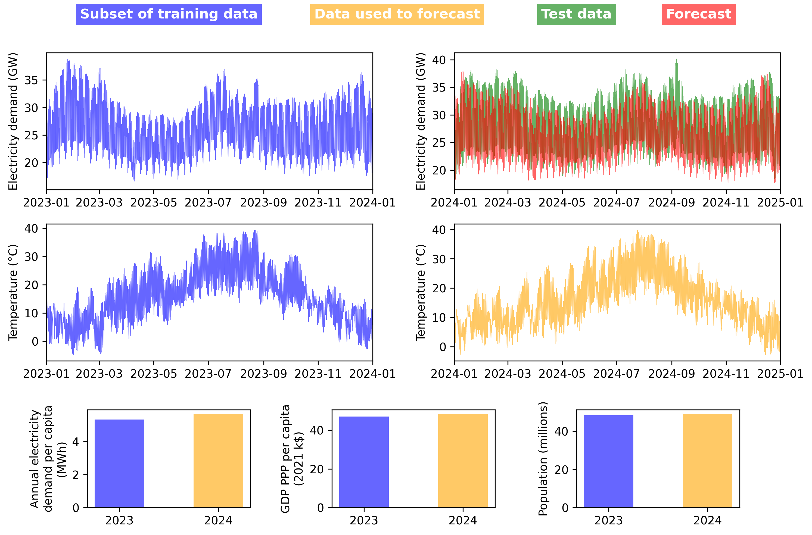

# Getting Started (Extended)

This guide provides a comprehensive introduction to setting up and using DemandCast. It covers installation, configuration, basic usage, and answers to frequently asked questions.

## 1. Installation and Setup

To install DemandCast, follow these steps:

### 1.1 Clone the repository

```bash
git clone https://github.com/open-energy-transition/demandcast.git
cd demandcast
```

### 1.2 Set up your environment

This project uses [`uv`](https://github.com/astral-sh/uv) as a package manager to install the required dependencies and create an environment stored in `.venv`.

`uv` can be used within the provided Dockerfile or installed standalone (see [installing uv](https://docs.astral.sh/uv/getting-started/installation/)).

The `demandcast` folder contains a `pyproject.toml` file that defines all the dependencies for the project.

To set up the environment, run:
```bash
cd demandcast
uv sync
```

Alternatively, you may use a package manager of your choice (e.g., `conda`) to install the dependencies listed in the `pyproject.toml`. If you choose this approach, please adjust the commands below to align with the conventions of your selected package manager.

### 1.3 Configure environment variables

Some modules require API keys to access data from external services. These keys should be stored in a `.env` file in the `demandcast/` directory. The `.env` file should not be included in the repository and should contain the following environment variables:

```plaintext
CDS_API_KEY=<your_key>             # For data retrieval from Copernicus CDS
ENTSOE_API_KEY=<your_key>          # For data retrieval from ENTSO-E
EIA_API_KEY=<your_key>             # For data retrieval from EIA
ZENODO_API_KEY=<your_key>          # For data upload to Zenodo
SANDBOX_ZENODO_API_KEY=<your_key>  # For data upload to Zenodo Sandbox
```

Replace `<your_key>` with your actual API keys. You can obtain these keys by registering on the respective service websites.

## 2. Retrieving Data

---

**Note**: You can skip this section if you prefer to use the pre-downloaded data available in this [Google Cloud Storage bucket](https://console.cloud.google.com/storage/browser/demandcast_data) (freely accessible with a Google account). Alternatively, the direct links to the data have the following format: `https://storage.googleapis.com/demandcast_data/{variable}/{country_or_subdivision_code}.parquet`

---

The following commands will execute the `demandcast/retrieve.py` script to retrieve different types of data. All parameters are configured through the `demandcast/config/retrieve_config.yaml` file. You can specify a custom config file using the `--config` argument. Please refer to the documentation of the retrieval modules for more details on configuration variables.

### 2.1 Retrieve Electricity Demand

The following command retrieves electricity demand from all available data sources:

```bash
cd demandcast
uv run retrieve.py
```

To retrieve data for a specific country or data source, edit the `demandcast/config/retrieve_config.yaml` file:

```yaml
variable: electricity_demand
data_source: entsoe              # Specify data source
code: DEU                        # Specify country code
```

Then run:

```bash
cd demandcast
uv run retrieve.py --config config/retrieve_config.yaml
```

### 2.2 Retrieve Annual Electricity Demand per Capita

To retrieve annual electricity demand per capita, configure the `demandcast/config/retrieve_config.yaml` file:

```yaml
variable: annual_electricity_demand_per_capita
code: FRA                        # Specific country
year: 2020                       # Specific year
# Or use ranges:
# start_year: 2015
# end_year: 2020
```

For projected data, specify the scenario:

```yaml
variable: annual_electricity_demand_per_capita
code: GBR
year: 2030
scenario: SSP2-Baseline
```

Then run:

```bash
cd demandcast
uv run retrieve.py --config config/retrieve_config.yaml
```

### 2.3 Retrieve GDP PPP per Capita

To retrieve GDP PPP per capita, configure the `demandcast/config/retrieve_config.yaml` file:

```yaml
variable: gdp_ppp_per_capita
code: JPN
year: 2019
```

For projected data:

```yaml
variable: gdp_ppp_per_capita
code: CAN
year: 2040
scenario: SSP1
```

Then run:

```bash
cd demandcast
uv run retrieve.py --config config/retrieve_config.yaml
```

### 2.4 Retrieve Population

To retrieve population data, configure the `demandcast/config/retrieve_config.yaml` file:

```yaml
variable: population
code: IND
year: 2015
```

For projected data:

```yaml
variable: population
code: BRA
year: 2050
scenario: SSP3
```

Then run:

```bash
cd demandcast
uv run retrieve.py --config config/retrieve_config.yaml
```

### 2.5 Retrieve Temperature

To retrieve temperature data, configure the `demandcast/config/retrieve_config.yaml` file:

```yaml
variable: temperature
code: NER
year: 2010
```

For projected data:

```yaml
variable: temperature
code: AUS
year: 2045
climate_model: CESM2
scenario: SSP4-6.0
```

Then run:

```bash
cd demandcast
uv run retrieve.py --config config/retrieve_config.yaml
```

## 3. Preprocessing and Training Models

---

**Note**: You can skip this section if you want to use pre-trained models available in this [Google Cloud Storage bucket](https://console.cloud.google.com/storage/browser/demandcast_data) (freely accessible with a Google account).

---

After retrieving the necessary data, you can proceed with preprocessing and training the models. The preprocessing and training scripts are located in the `demandcast/` directory. Currently, XGBoost is the only available model.

Our approach involves using socioeconomic and weather parameters passed to a model to predict the hourly electricity demand. The preprocessing step involves merging and cleaning the retrieved annual electricity demand per capita, GDP PPP per capita, temperature, and electricity demand data. In the processing and training, the socioeconomic and weather data are needed only for the years and countries/subdivisions for which electricity demand data is available.

### 3.1 Preprocessing

The following command runs the preprocessing script to prepare the data for model training:

```bash
cd demandcast
uv run assemble.py
```

Configuration parameters can be set in `demandcast/config/assemble_config.yaml`.

### 3.2 Training

The following command runs the training script to train the model:

```bash
cd demandcast
uv run train.py
```

Configuration parameters for training can be set in `demandcast/config/train_config.yaml` and `demandcast/config/ml_config.yaml`.

## 4. Forecasting

Once the model is trained, you can use it to make forecasts. The forecasting script is located in the `demandcast/` directory. Currently, XGBoost is the only available model.

The forecasting script requires the trained model file and the input data file as arguments. The input data includes the socioeconomic and weather parameters for the period you want to forecast. This means that you need to provide the annual electricity demand per capita, GDP PPP per capita, and temperature data for the forecast period. Because electricity demand is predicted in a normalized form, the input data must also include population, which is used to get the total electricity demand from the per capita values, which is in turn used to denormalize the predictions.

The following command runs the forecasting script to make predictions:

```bash
cd demandcast
uv run forecast.py
```

Configuration parameters for forecasting can be set in `demandcast/config/forecast_config.yaml`.

## 5. Example

Here we provide an example of what the typical data pipeline looks like when using DemandCast.

The figure below illustrates the retreved electricity demand data for Spain (ESP) for 2023 and 2024, along with the annual electricity demand per capita, GDP PPP per capita, and temperature data in the same years. The data for 2023 is a subset of the whole data used for training the model, which includes data from multiple countries/subdivisions and years. The historical electricity demand data for 2024 is used to evaluate the model's performance, while the annual electricity demand per capita, GDP PPP per capita, and temperature data for 2024 are used as input features to forecast the electricity demand for the same year.


