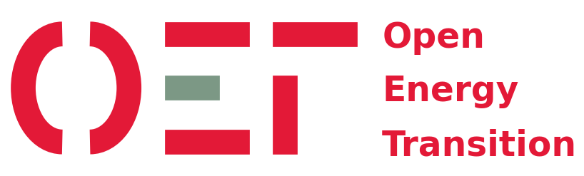
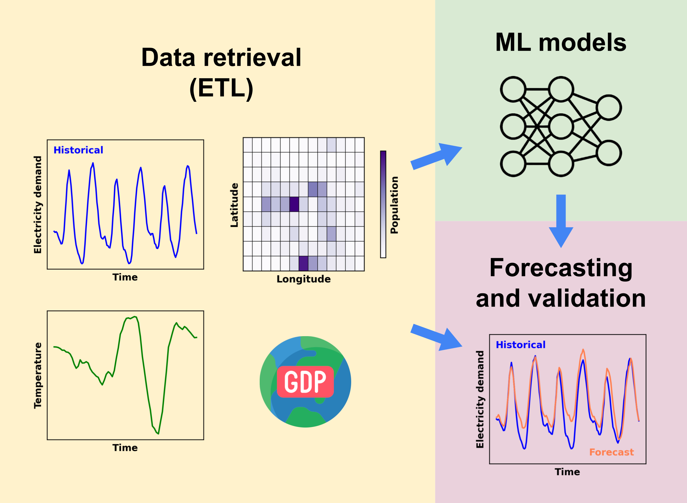

<h1 align="center"><b>DemandCast</b></h1>

<h2 align="center"><b>Global hourly electricity demand forecasting</b></h2>

<h3 align="center"><b>A project developed by</b></h3>

<p align="center">
    <a href="https://openenergytransition.org/">
        
    </a>
</p>

<h3 align="center"><b>Supported by</b></h3>

<p align="center">
    <a href="https://www.breakthroughenergy.org/">
        
    </a>
</p>

## About

DemandCast is a Python-based project focused on collecting, processing, and forecasting hourly electricity demand data. The aim of this project is to support energy planning studies by using machine learning models to generate hourly time series of future electricity demand or for countries without available data.

### Features

- Retrieval of hourly and sub-hourly electricity demand data from public sources.
- Retrieval of weather and socio-economic data.
- Training and validation of machine learning models.
- Forecasting using trained machine learning models.
- Modular design for adding new countries or data sources.
- Support for reproducible, containerized development.

#### Feature roadmap

The project is in active development and we are always looking for suggestions and contributions. Below is a non-exhaustive list of planned features:

- Add support to forecast electricity demand in user-defined subnational regions.
- Enhance model training by integrating new datasets:
    - New countries and subdivisions with available electricity demand data,
    - Sectoral electricity demand (agriculture, industry, transport, buildings),
    - Adoption of EVs, air conditioning, and heat pumps.
- Add and test new machine learning models for forecasting (e.g., [timesfm](https://github.com/google-research/timesfm)).
- Add quality checks of electricity demand time series.
- Improve validation by considering simultaneity of peaks between actual and forecast electricity demand.
- Package the project for easier installation and usage.

## Documentation

The documentation is currently hosted on GitHub pages connected to this repository. It is built with [mkdocs](https://github.com/squidfunk/mkdocs-material).

To run it locally:

```bash
cd webpage
uv run mkdocs serve
```

Other online resources include:

- [Paper](https://arxiv.org/abs/2510.08000) accepted at the [NeurIPS 2025 Workshop](https://www.climatechange.ai/papers/neurips2025/42): Tackling Climate Change with Machine Learning.
- [Poster](https://s3.us-east-1.amazonaws.com/climate-change-ai/papers/neurips2025/42/poster.pdf) presented at the NeurIPS 2025 Workshop.
- [Video presentation](https://recorder-v3.slideslive.com/?share=107690&s=ed044008-3b06-4462-a839-b82b888eeb46) recorded for the NeurIPS 2025 Workshop.

## Contributing

We welcome contributions in the form of:

- Country-specific data retrieval modules
- New or improved forecasting models
- Documentation and testing enhancements

Please follow the repository’s structure and submit your changes via pull request.

We also would like to hear your feedback and suggestions. You can share your thoughts by completing this short [survey](https://forms.gle/nMYvCAfzbrUDjqRQ8).

## Repository structure

```
demandcast/
├── .github/                        # Github specifics such as actions
├── demandcast/
│   ├── checks/                     # Modules to perform data availability and quality checks
│   ├── config/                     # Configuration files for all scripts
│   ├── figures/                    # Modules to plot figures and resulting figures
│   ├── ml_models/                  # Machine learning models for forecasting electricity demand
│   ├── retrievals/                 # Modules to retrieve data from various sources
│   ├── shapes/                     # Scripts to generate shapes for non-standard subdivisions and resulting shapefiles
│   ├── tests/                      # Unit tests for the utilities and retrieval scripts
│   ├── utils/                      # Shared utilities for data fetching, processing, and uploading
│   ├── .dockerignore               # Files and directories to ignore in Docker build context
│   ├── .env                        # API keys (not included in repo)
│   ├── .python-version             # Python version for the environment
│   ├── Dockerfile                  # Dockerfile to create an image for the project
│   ├── assemble.py                 # Script to assemble/preprocess data
│   ├── check.py                    # Script to run data checks
│   ├── cross_validate.py           # Script to cross-validate models
│   ├── forecast.py                 # Script to generate forecasts
│   ├── plot.py                     # Script to generate plots for the data
│   ├── pyproject.toml              # Project configuration and dependencies
│   ├── retrieve.py                 # Main script to download and process data
│   ├── run_all.sh                  # Shell script to run all processes sequentially
│   ├── train.py                    # Script to train models
│   ├── upload.py                   # Script to upload data
│   ├── uv.lock                     # Locked dependencies for the project
│   └── validate.py                 # Script to validate data
├── webpage/                        # Documentation website files (MkDocs)
├── .gitattributes                  # Git attributes for handling line endings
├── .gitignore                      # File lists that git ignores
├── .pre-commit-config.yaml         # Pre-commit configuration
├── CONTRIBUTING.md                 # Guide to contributing
├── LICENSE                         # License file
├── README.md                       # Project overview and instructions
├── ruff.toml                       # Ruff configuration
└── security.md                     # Security policy
```



## Data sources

The table below provides an overview of the data sources currently used in DemandCast for hourly and sub-hourly electricity demand, weather, and socio-economic data for both historical and forecasted periods.

|Data type|Historical data source|Forecast data source|
|---|---|---|
|Hourly and sub-hourly<br>electricity demand|Various public sources listed in the<br>[Awesome Electricity Demand repository](https://github.com/open-energy-transition/Awesome-Electricity-Demand)| -- |
|Temperature|[ERA5](https://cds.climate.copernicus.eu/datasets/reanalysis-era5-single-levels)|[CMIP6](https://cds.climate.copernicus.eu/datasets/projections-cmip6)|
|Gridded population|[SEDAC GPW v4](https://data.ghg.center/sedac-popdensity-yeargrid5yr-v4.11/browseui/#sedac-popdensity-yeargrid5yr-v4.11/)|[Wang X. et al. (2022)](https://doi.org/10.6084/m9.figshare.19608594)|
|National population|[World Bank](https://data.worldbank.org/indicator/SP.POP.TOTL)|[IIASA SSP Database](https://data.ece.iiasa.ac.at/ssp)|
|Gridded GDP, PPP|[Wang T. et al. (2022)](https://zenodo.org/records/7898409)|[Wang T. et al. (2022)](https://zenodo.org/records/7898409)|
|National GDP per capita, PPP|[World Bank](https://data.worldbank.org/indicator/NY.GDP.PCAP.PP.KD), [IMF](https://data.imf.org/en/Data-Explorer?datasetUrn=IMF.RES:WEO(6.0.0)&INDICATOR=NGDPRPPPPC)|[IIASA SSP Database](https://data.ece.iiasa.ac.at/ssp)|
|National annual electricity<br>demand per capita|[Ember](https://ember-energy.org/data/yearly-electricity-data/), [World Bank](https://data.worldbank.org/indicator/EG.USE.ELEC.KH.PC)|[IIASA SSP Database](https://tntcat.iiasa.ac.at/SspDb)|

The map below shows the countries and subdivisions for which retrieval modules of electricity demand data are currently available in DemandCast.


You can find the code that we used to retrieve the data in their respective files inside the [demandcast/retrievals](https://github.com/open-energy-transition/demandcast/tree/main/demandcast/retrievals) folder.

You can find the electricity demand data that we retrieved at different points in time in this [Google Cloud Storage bucket](https://console.cloud.google.com/storage/browser/demandcast_data) (freely accessible with a Google account). Alternatively, the direct links to the data have the following format:

```https://storage.googleapis.com/demandcast_data/{variable}/{country_or_subdivision_code}.parquet```

## Basic getting started guide

An extended getting started guide is available in the [documentation](https://open-energy-transition.github.io/demandcast/getting_started/).

### 1. Clone the repository

```bash
git clone https://github.com/open-energy-transition/demandcast.git
cd demandcast
```

### 2. Set up your environment

This project uses [`uv`](https://github.com/astral-sh/uv) as a package manager to install the required dependencies and create an environment stored in `.venv`.

`uv` can be used within the provided Dockerfile or installed standalone (see [installing uv](https://docs.astral.sh/uv/getting-started/installation/)).

The `demandcast` folder contains a `pyproject.toml` file that defines all the dependencies for the project.

To set up the environment, run:
```bash
cd demandcast
uv sync
```

Alternatively, you may use a package manager of your choice (e.g., `conda`) to install the dependencies listed in the `pyproject.toml`. If you choose this approach, please adjust the commands below to align with the conventions of your selected package manager.

### 3. Run scripts

Scripts can be run directly using:

```bash
cd demandcast
uv run script.py
```

Scripts accept configuration files to customize their behavior. Configuration files are located in `demandcast/config/`. The default name of the configuration file is `{script_name}_config.yaml`.

Jupyter notebooks ([details](https://docs.astral.sh/uv/guides/integration/jupyter/#using-jupyter-within-a-project)) can be launched with:

```bash
cd demandcast
uv run --with jupyter jupyter lab --allow-root
```

## Development workflow

### Run tests and check test coverage

```bash
cd demandcast
uv run pytest --cov=utils --cov-report=term-missing
```

### Pre-commit and lint code

To ensure code quality, we use [pre-commit](https://pre-commit.com/) hooks. These hooks automatically run checks on your code before committing changes. Among the pre-commit hooks, we also use [ruff](https://docs.astral.sh/ruff/) to enforce code style and linting. All the pre-commit hooks are defined in the `.pre-commit-config.yaml` file.

To run pre-commit hooks, you can use:
```bash
uvx pre-commit
```

## Maintainers

The project is maintained by the [Open Energy Transition](https://openenergytransition.org/) team. The team members currently involved in this project are:

- [Enrico Antonini](https://github.com/eantonini) (enrico.antonini at openenergytransition dot org)
- [Vamsi Priya Goli](https://github.com/Vamsipriya22) (goli.vamsi at openenergytransition dot org)

## License

This project is licensed under the GNU Affero General Public License v3.0 (AGPL-3.0).
